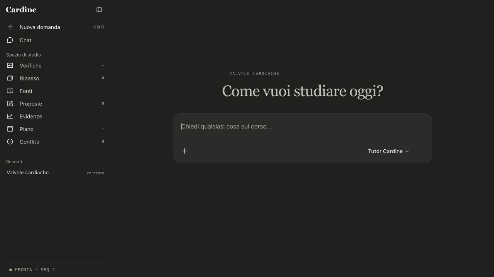

# Cardine

A study workspace for medical students. You ask in plain words — *"I have ten
minutes, help me understand heart valves"* — and Cardine teaches from **your
own course material**, remembers where you left off, and shows the evidence
behind every answer.



## Why it's different from a chat with an LLM

- **It remembers.** Courses, sources, sessions and what you've learned are
  stored outside the conversation, so a session can stop and resume days later.
- **It's grounded.** Answers come from the sources you added, and you can see
  which ones.
- **The model doesn't own the truth.** The LLM only *proposes* actions. The
  runtime decides what is recorded, in an append-only event log that can be
  replayed to rebuild any state.
- **Any model.** Providers plug in through adapters; everything runs offline
  for tests and demos.

## How it's built

```text
Browser UI / CLI          → presentation only
HTTP runtime              → auth, sessions, composition
Study Agent Harness core  → events, sources, tools, skills
Model adapters            → swappable LLM providers
```

The UI never writes state directly: every change goes through the runtime.
The core is a copy of my open
[Study Agent Harness](https://github.com/EbrahimAbdelwahed/study-agent-harness).

## Try it

Python 3.12, no API key needed:

```bash
python3.12 -m venv .venv && .venv/bin/pip install -e .
.venv/bin/cardine-demo
.venv/bin/cardine-shell "Help me understand heart valves."
```

Developer setup, deployment and design decisions live in
[`CONTRIBUTING.md`](CONTRIBUTING.md), [`docs/`](docs/) and
[`docs/decisions/`](docs/decisions/).

## Status

Personal product, actively developed. Source is visible but not open source —
see [`LICENSE-CARDINE.md`](LICENSE-CARDINE.md) and [`NOTICE.md`](NOTICE.md).
