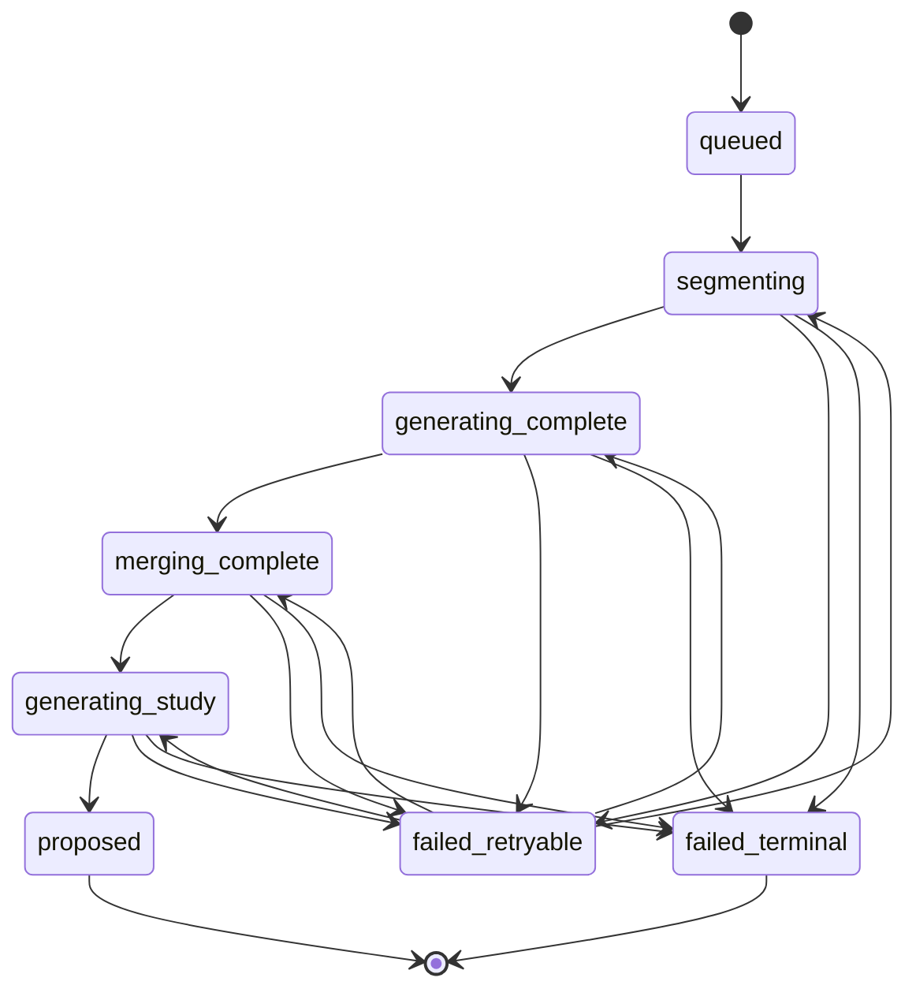

# Spec: generazione materiali da sbobina

Status: **Slice 02 implemented — awaiting user review**
Date: 2026-08-14
Area: Cardine / materials / generated sources

The user authorized and completed Slice 02. Slices 03–04 remain unauthorized.

## Next Agent Prompt

Slices 01 and 02 are implemented and verified. Review the restart-safe paired
generation evidence; do not begin Slice 03 until the user explicitly approves
continuation.

Warnings:

- Preserve the existing dirty worktree and concurrent source-viewer,
  conversation-memory, and flashcard-scope changes.
- Never classify generated material as an original source.
- Never call a provider from the browser or outside the configured
  `openai-gpt-5.6-luna` adapter and consent boundary.
- The Claude/Fable planning pass was unavailable because the local CLI was not
  authenticated. Three differently biased Codex drafts were synthesized
  instead.

Global checklist:

- [x] User explicitly approves this plan.
- [x] [Slice 01](slices/01-material-and-lineage-contracts.md): implement the
  lesson-material and generated-source lineage contracts.
- [x] [Slice 02](slices/02-restart-safe-paired-generation.md): generate the
  complete/study pair as one restart-safe proposal batch.
- [ ] [Slice 03](slices/03-human-approval-and-publication.md): publish only
  explicitly approved outputs as correctly provenanced canonical sources.
- [ ] [Slice 04](slices/04-product-entrypoints-and-review.md): expose the same
  workflow from the Sources page and exact-source chat attachment.

The next agent must update this section before ending its pass.

## Agreed outcome

Starting from exactly one text or Markdown sbobina already admitted to Cardine,
the learner can generate:

1. **Materiale completo** — a faithful, reorganized lesson that removes filler
   and overlap while preserving detail, teacher emphasis, clinical examples,
   uncertainty markers and untranscribable gaps. It must not add facts.
2. **Materiale studio** — derived from the immutable complete output, not from
   the raw transcript; it removes redundancy and logistics but is not a summary
   and does not intentionally discard study content.

Both outputs are reviewable proposals. They become indexed sources usable by
chat and flashcard generation only after explicit HUMAN approval.

The workflow can be started either by a button on an exact source revision or by
a chat request carrying that same exact full-source attachment. Both entrypoints
call one application service and return the same idempotent job.

## Non-goals

- Audio upload, transcription, correction, OCR or speaker separation.
- Automatic generation after source upload or repository startup.
- PDF input for this workflow.
- Images, chemical rendering, Obsidian sync, Anki import/export or flashcard
  generation inside this workflow.
- Automatic acceptance, sibling acceptance, silent fallback providers or the
  `gpt-5.6` family alias.
- Multi-source generation, cross-course generation, editing a proposal in
  place, a new retrieval index, or a new generic jobs framework.
- Porting the old DeepSeek/Kimi client or its filesystem layout.

## Product invariants

- The input is one immutable current source revision, pinned by course,
  source, revision and content digest. Excerpts and ambiguous/latest pointers
  are invalid inputs.
- A source that becomes retired or superseded makes an unfinished or
  unpublished job `stale`; stale outputs cannot be published. Regeneration uses
  the newer revision and a new run identity.
- The complete and study outputs are created atomically as one generated
  proposal batch: both become reviewable or neither does.
- The study output records the complete output blob as its direct parent.
- Approval decisions are independent; publication is dependency-aware:
  complete may publish alone, while study cannot publish before complete.
- Rejected or pending content never enters canonical source projections or
  retrieval indexes.
- Generated Markdown lives in the existing content-addressed blob store. Event
  and job records carry hashes and bounded manifests, not large Markdown bodies.
- Existing source projection/chunking and indexing remain the only owners of
  canonical sources and derived indexes.
- UI components submit commands and render state; they never call Luna,
  infer approval, publish sources or write index state.

## End-state ownership

| Concept | Single owner |
|---|---|
| Original transcript bytes and revision identity | Existing canonical source subsystem |
| Material job state, checkpoints and paired sequencing | New Cardine material-generation application module |
| Long generated Markdown bytes | Existing content-addressed blob store |
| Proposal lifecycle and HUMAN decisions | Existing artifact service, extended with lesson-material content |
| Generated-source lineage and publication | New generated-source materializer at the ingestion boundary |
| Provider call | Existing configured `ModelPort` / GPT-5.6 Luna adapter |
| FTS/PageIndex rebuild | Existing indexing coordinator |
| Entry-point transport and presentation | Existing Cardine browser/API and tutor host |

The implementation must not introduce a second artifact lifecycle, source
catalog, index, model client, attachment resolver or decision store.

## Proposed contracts

### Lesson-material proposal

Add `StudyArtifactKind.LESSON_MATERIAL` with a bounded envelope that references,
rather than embeds, the generated Markdown:

```text
LessonMaterialContent
  variant: complete | study
  title: text
  markdown_blob: BlobRef
  markdown_character_length: positive int
  direct_parent_blob_sha256: transcript blob digest | complete output blob digest
  limitations: bounded text list
```

Generated artifact provenance remains the source of prompt, model, validator,
run, read-dependency and canonical source commitments. The study content's
direct parent must equal the complete proposal's blob digest.

### Generated canonical source

Do not widen `TextIngestionService.ingest` so callers can label arbitrary text
as generated. Introduce a dedicated `GeneratedSourceMaterializer` and a strict
`source.revision_ingested@2` payload for generated material. Existing v1
original/extracted events remain byte-stable and replayable.

`GeneratedDocumentProvenance` must include:

- root transcript source/revision/blob digest;
- originating artifact revision and material run;
- variant and direct parent digest;
- prompt composition and Luna model receipt fingerprints;
- validator/proof fingerprint;
- HUMAN decision identity and time.

The materializer alone may write a source with
`ContentOrigin.GENERATED` and `StructureOrigin.HUMAN_APPROVED`.

### Job state



Each checkpoint stores exact input/output blob hashes, next segment ordinal,
prompt/model/pipeline pins, proof receipts and a CAS generation. The job ID is
deterministic over course, session and caller idempotency key; the stored
request fingerprint binds the exact source revision/digest and pipeline
manifest. Reusing the same request ID with changed pins conflicts and never
mutates an old run; explicit regeneration uses a new request ID.
The generation job terminates at `proposed`; it never copies decision state.
Decision and acceptance status are read from the existing artifact projection,
while publication reconciliation stores only its own derived-source receipts.

### Approval and publication

- Complete accepted: publish/index complete even if study is pending or
  rejected.
- Study accepted while complete is pending: record the HUMAN decision, mark
  `approved_blocked_on_complete`, publish neither study nor an implicit sibling.
- Complete later accepted: publish complete first, then the already-approved
  study idempotently.
- Complete rejected: study can never publish for that pair. Regenerate a new
  pair rather than rewriting lineage.

## Pipeline semantics

The historical workflow is translated, not copied:

1. Read exact canonical transcript bytes; no filesystem path authority.
2. Split into numbered bounded units deterministically.
3. Ask Luna for strict structured thematic boundaries; validate ordered,
   gap-free coverage and bounded overlap.
4. Generate faithful complete Markdown per segment with versioned prompts.
5. Merge segments with overlap deduplication into one immutable complete blob.
6. Generate study Markdown from that exact complete blob.
7. Validate UTF-8/Markdown bounds, required structure, source commitment,
   preserved uncertainty markers and mechanically checkable emphasis/numeric
   anchors. These checks prove structure and lineage, not semantic truth.
8. Record both outputs atomically as generated proposals.

Prompt families are versioned in Cardine as `complete-segment@1`,
`complete-merge@1` and `study-from-complete@1`. They preserve the old rules
that prohibit invention and define “studio” as deduplicated rather than
summarized, while using the current course profile instead of hard-coded
filesystem subject directories.

## Slice graph and review map

| Slice | Unlocks | Human-visible checkpoint |
|---|---|---|
| 01 | Correct content and lineage vocabulary, replay-safe before any provider work | Headless fixture prints proposed material and generated-source manifests |
| 02 | Restart-safe complete + study proposal pair | CLI/headless scripted-model run shows both reviewable outputs and recovery trace |
| 03 | Explicit decisions and canonical publication | Headless journey proves mixed decisions, lineage, retrieval and flashcard eligibility |
| 04 | Source button, exact-attached chat trigger and review UI | Browser journey from source to proposals to published Materials |

Dependencies are linear: `01 -> 02 -> 03 -> 04`. Each slice must be accepted on
its own evidence before the next begins.

## Global verification

Run the narrowest new tests first, then relevant existing gates:

- artifact content/identity/event/projection tests;
- source v1/v2 replay, ingestion, integrity and retrieval tests;
- generation worker checkpoint/recovery and provider-zero tests;
- end-to-end proposal/decision/materialization/index/retrieval journey;
- both product entrypoints resolving the same job;
- existing flashcard proposal and pinned-source journeys;
- JavaScript syntax, Ruff, focused strict mypy, `git diff --check`;
- wheel/package-data check for versioned prompts;
- one independent semantic review after each medium-risk slice;
- a security review for the generated-source/provenance and untrusted Markdown
  boundary in Slices 01 and 03.

Any visual change in Slice 04 must end with the unprimed `screenshot-critique`
gate before acceptance. There is no supplied visual target, so
`compare-screenshots` is not required unless implementation adds one to this
spec.

## Known risks

- **False provenance:** the largest risk; blocked by a dedicated v2 materializer
  and HUMAN approval.
- **Long inputs/outputs:** segment and checkpoint blobs; keep large content out
  of SQLite CAS records and event payloads.
- **Hallucination or omission:** validators cannot prove medical fidelity;
  preserve lineage and require full human review.
- **Crash after decision but before source admission:** deterministic source IDs
  and publication reconciliation must resume without duplicate events.
- **Concurrent decisions/indexing:** expected sequence plus job CAS; indexing
  begins only after canonical admission.
- **Dirty shared worktree:** reserve exact paths and integrate, never overwrite,
  the current source-viewer/conversation changes.

## Alternatives rejected

- Reuse `StudyBriefContent`: too small and semantically wrong for long complete
  Markdown documents.
- Save generated text as an original upload: destroys provenance.
- Let the study output publish without its complete parent: breaks direct
  lineage and permits canonical use of a derivative whose parent was rejected.
- One synchronous HTTP request: not restart-safe for multiple long model calls.
- A new generic queue/index/artifact store: duplicates existing owners.
- Copy legacy DeepSeek/Kimi code and subject directories: violates the current
  model and modularity contracts.

## Approval requested

Approval authorizes planning-to-implementation transition for **Slice 01 only**.
Later slices still require the prior slice's verification and review checkpoint;
approval does not authorize automatic provider calls, migration of existing
sources, cleanup of unrelated changes, commits or pushes.
